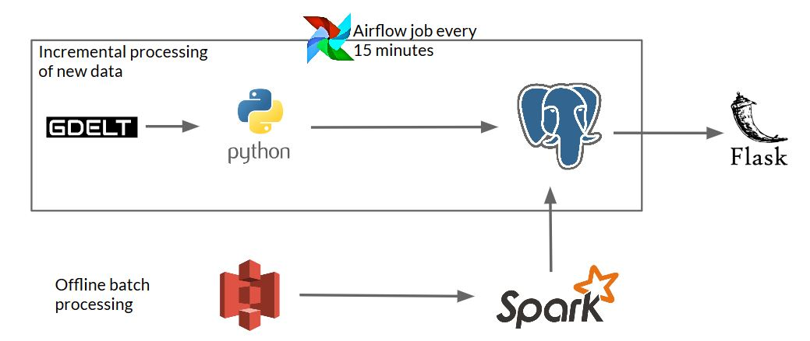
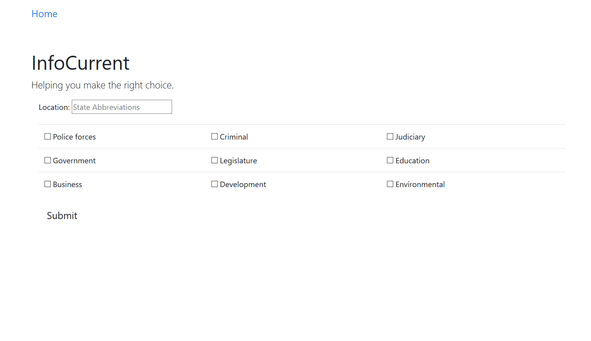

# InfoCurrent
Helping home buyers know the impact that local actors are having on a state

## Business Use Case
A home buyer weighs multiple factors when in the

---
## Solution
Link: infocurrent.xyz

---
### Global Database of Event, Language and Tone (GDELT)
The GDELT project collects news stories from print and web sources from around
the world. It's able to identify a number of people, organizations, themes,
emotions, and ultimately events that are driving the global soceity. This live
data mining projects produces one of the largest open spatiotemporal datasets
that exist.

---
## ETL Pipeline

New GDELT updates are acquired from the source. A Python script processes the
data and places it in a PostgreSQL database. Since GDELT updates are posted
every 15 minutes, an Airflow workflow is scheduled to complete this process as
new data arrives.

GDELT's historic data exists in an Amazon S3 bucket. An offline batch
processing Apache Spark job reads and processes the data from S3. The
processed data is saved in a PostgreSQL database.
The user facing component of this pipeline is the Flask application.
The user is able to specify a single state, and a set of actors they are
interested in. The application makes the appropriate queries to the PostgreSQL
database. The results are viewed on the Flask application.

---
## User Interface
Link to Flask application: [infocurrent.xyz](infocurrent.xyz)

---
## Installation

---
### Usage

---
## Presentation link